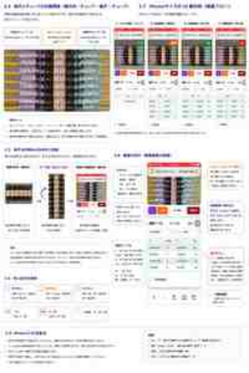

# VisionLink ユーザーガイド（Prototype）

VisionLink の検査担当者向け操作マニュアルです。
技術仕様は [SPEC.md](SPEC.md)、構成は [ARCHITECTURE.md](ARCHITECTURE.md)、OCR の詳細は [OCR_STRATEGY.md](OCR_STRATEGY.md) を参照してください。

> **現在の位置づけ**: 2026-08-24 時点の実機確認済みプロトタイプを基準にしています。本番運用版ではありません。

## 目次

1. [VisionLinkとは](#1-visionlinkとは)
2. [検査対象と端子台の向き](#2-検査対象と端子台の向き)
3. [iPhoneでの実際の画面](#3-iphoneでの実際の画面)
4. [検査前の準備](#4-検査前の準備)
5. [基本的な検査手順](#5-基本的な検査手順)
6. [L ボタン](#6-l-ボタン)
7. [Label ボタン](#7-label-ボタン)
8. [BBoxと読取方向表示](#8-bboxと読取方向表示)
9. [端子番号と線番の照合](#9-端子番号と線番の照合)
10. [検査テーブルの見方](#10-検査テーブルの見方)
11. [うまく読めない場合](#11-うまく読めない場合)
12. [注意事項](#12-注意事項)

---

## 1. VisionLinkとは

VisionLink は、端子台・配線の検査を iPhone 等のカメラ画像と AI で支援する Web アプリケーションです。

カメラ画像から YOLO で検査対象を検出し、PaddleOCR で文字を読み取り、あらかじめ用意された CSV の検査データと照合します。

検査する1端子は次の3要素で構成します。

- **L**: 端子左側の Tube（線番）
- **Label / nmb**: 端子番号
- **R**: 端子右側の Tube（線番）

## 2. 検査対象と端子台の向き

### 2.1 実物上の位置関係

1端子についての基本関係は、端子台を組み立てた状態では次のとおりです。

```text
左側                                     右側

 Tube（L） ───── 端子（Label / nmb） ───── Tube（R）
   線番                  端子番号                 線番
```

つまり **「Tube ― 端子 ― Tube」** が基本単位です。

### 2.2 VisionLinkでは端子台を縦向きに読み込む

実際の検査では、この端子台を **90度向きを変えて縦向き** にし、iPhoneのカメラへ収めます。

```text
実物の基本関係

Tube ─ 端子 ─ Tube

       ↓ 端子台を90度向きを変えて撮影

       Tube
         │
       端子
         │
       Tube
```

ただし、これは「1端子の対応関係が上下になる」という意味ではありません。

**検査ロジック上の対応関係は常に L ― Label ― R です。**
カメラ画像上では、縦向きに収めた端子台の中央に端子番号列が並び、その左右にTubeの線番列が並びます。

概念的には次のようになります。

```text
        iPhoneカメラ画面

    左Tube列      Label列       右Tube列

      AAAAA          6            AAAAA
      BBBBB          7            BBBBB
      CCCCC          8            CCCCC
      DDDDD          9            DDDDD

       L             Label           R
```

この状態がVisionLinkの基本的な読取姿勢です。

## 3. iPhoneでの実際の画面

実機では Safari から VisionLink を開き、端子台を**縦向きに画面へ収めて**検査します。

以下は実際の検査時の画面例です。

<p align="center">
  
</p>

> 画像はユーザーガイド掲載用にリサイズしています。実際の画面では端子台、BBox、操作ボタン、検査テーブルを同一画面上で確認します。

### 3.1 画面上部：カメラ・BBox

カメラ映像では、中央の端子番号列と左右のTube列を同時に映します。

- 左側：L Tube
- 中央：Label / nmb
- 右側：R Tube

BBoxはYOLOが元カメラ画像上で検出した領域を示します。

### 3.2 操作ボタン

| ボタン | 用途 |
|---|---|
| **L** | 左TubeのOCR向きを180度補正 |
| **Label** | nmbのOCR向きを90度補正 |
| **カメラ開始 / 停止** | ライブ映像の開始・停止 |
| **検査開始 / 停止** | OCR・照合処理の開始・停止 |

### 3.3 画面下部：検査テーブル

検査結果は `L / Label / R / ALL` の並びで確認します。

- `L`: 左Tubeの線番
- `Label`: 端子番号
- `R`: 右Tubeの線番
- `ALL`: 1端子として左右・Labelが揃った結果

緑表示はCSVの期待値との一致を示します。

## 4. 検査前の準備

1. iPhoneを社内LAN/Wi-Fiへ接続します。
2. SafariからVisionLinkを開きます。
3. 製番・盤・端子台を選択し、検査CSVを読み込みます。
4. **端子台を縦向きにしてカメラへ収めます。**
5. 中央のLabel列と、その左右のTube列が同時に映る位置へ調整します。
6. 必要に応じて `L` / `Label` の回転補正を設定します。

照明の反射、ピンぼけ、極端な斜め撮影はOCR精度を低下させます。

## 5. 基本的な検査手順

1. **カメラ開始** を押します。
2. 端子台を縦向きに映します。
3. 中央の端子番号と左右TubeにBBoxが表示されることを確認します。
4. 必要に応じて **L** または **Label** をONにします。
5. **検査開始** を押します。
6. カメラを短時間安定させてOCRさせます。
7. 下部の検査テーブルで `L / Label / R / ALL` を確認します。
8. 未検査箇所がある場合はカメラ位置をゆっくり移動します。
9. 全対象の消込後、必要に応じて **作業者確認** をチェックします。
10. **完了** で検査を終了します。

## 6. L ボタン

`L` は左TubeのOCR方向補正です。

### OFF

左Tubeのクロップ画像をそのままOCRします。

### ON

- **左TubeのOCR用cropだけを180度回転**します。
- カメラ映像そのものは回転しません。
- BBoxも回転しません。
- 対象BBoxはL補正中であることが分かる表示になります。

左Tubeの文字が逆さになっている場合に使用します。

## 7. Label ボタン

`Label` は中央の端子番号（nmb）のOCR方向補正です。

端子台を縦向きに撮影した際、nmbの数字が画面上で右へ90度倒れている場合に使用します。

### ON時

```text
画面上のnmb
   ↓
右へ90度倒れている
   ↓
BBox領域をcrop
   ↓
OCR用cropだけ左へ90度回転
   ↓
正立した数字としてOCR
```

重要なのは、**オレンジのBBoxそのものを回転しているわけではない**ことです。

BBoxは元カメラ画像上の検出位置・形状のままで、OCRへ渡す画像だけを回転します。

## 8. BBoxと読取方向表示

| 表示 | 意味 |
|---|---|
| 水色系BBox | 通常の検出 / 回転補正なし |
| 紫系BBox | L Tube / 180度OCR補正対象 |
| オレンジ系BBox | Label / nmb / 90度OCR補正対象 |

回転補正が有効な場合は、対象となる最上段BBox付近に読取方向を示す矢印を表示します。

矢印は「BBoxを回転させた」という意味ではなく、**OCR用cropをどの向きへ補正しているか**を示します。

## 9. 端子番号と線番の照合

VisionLinkは中央のLabel / nmbをアンカーとして、その端子に対応する左右Tubeを探します。

画面上では次の関係です。

```text
            左Tube       Label       右Tube

端子6       H0D4F8V        6         H0D4F8V
端子7       P5X9Q2         7         P5X9Q2
端子8       D5A2L9F4       8         D5A2L9F4
端子9       V2C8M          9         V2C8M
```

### 端子ごとの検査範囲

隣接するLabelの中心位置の中間を境界として、各端子の検査範囲を分けます。

```text
──── Label 5 と Label 6 の中間 ────

   左Tube       [ Label 6 ]       右Tube

──── Label 6 と Label 7 の中間 ────

   左Tube       [ Label 7 ]       右Tube

──── Label 7 と Label 8 の中間 ────
```

その範囲内にあり、かつLabelより左側にあるTubeをL候補、右側にあるTubeをR候補としてCSVと照合します。

この方式により、隣接端子の線番を誤って別の端子へ対応付けることを抑えています。

## 10. 検査テーブルの見方

実機画面では次の4列を確認します。

| 列 | 内容 |
|---|---|
| `L` | 左Tube OCR結果 |
| `Label` | 端子番号OCR結果 |
| `R` | 右Tube OCR結果 |
| `ALL` | その端子の総合結果 |

### OK

`L / Label / R` が対象端子のCSV期待値と対応した場合、消込が進み、`ALL` が `OK` になります。

### 未完了

一部だけ認識された場合は、その認識済み項目だけが表示・消込され、端子全体は完了しません。

そのため、例えば左Tubeがまだ読めていなくても、Labelと右Tubeだけ先に認識される場合があります。

## 11. うまく読めない場合

### 端子番号が読めない

- 端子台が縦向きになっているか確認する
- nmbが右へ90度倒れて見える場合は **LabelをON**
- ピントと照明を調整する

### 左Tubeが読めない

左Tube文字が逆さの場合は **LをON** にします。

### BBoxは出るがOCRされない

- カメラを少し近づける
- 数秒静止する
- 反射を避ける
- 文字全体がBBox内に入っているか確認する

### 隣の端子の線番を拾う

中央のLabel列が正しく検出されているか確認してください。VisionLinkはLabel位置から各端子の検査帯を決めるため、Labelの検出状態が対応付け精度に影響します。

## 12. 注意事項

- 本版は **Prototype** です。
- 端子台は基本的に **縦向きで読み込みます**。
- 実物上の1端子の関係は **Tube ― 端子 ― Tube** です。
- 画面上の対応関係は **L ― Label ― R** です。
- `L` は左TubeのOCR用cropを180度補正します。
- `Label` は右へ90度倒れたnmbを読むため、OCR用cropを左へ90度補正します。
- **L / LabelをONにしてもBBoxそのものは回転しません。**
- AI/OCR結果のみを根拠として製品品質を確定しないでください。
- 誤認識を発見した場合は、対象端子・期待値・実際のOCR結果・可能であれば画像を記録してください。
