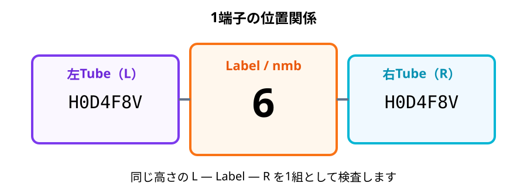
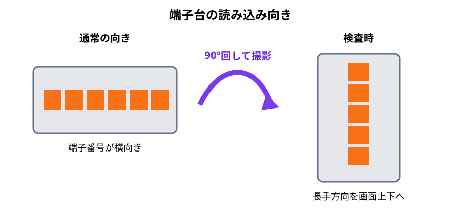
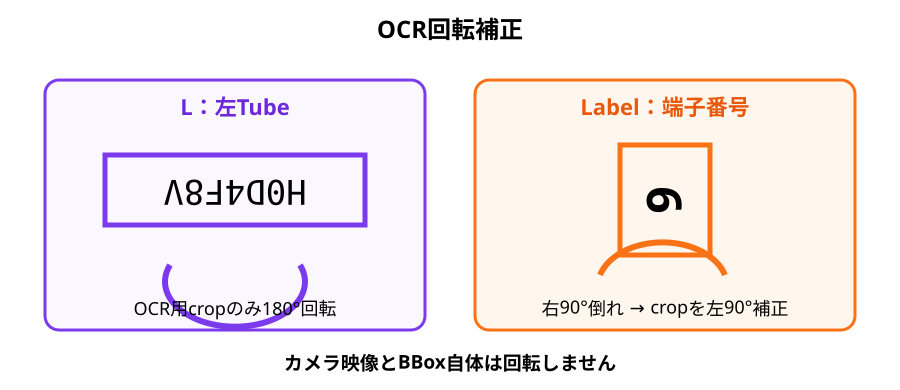
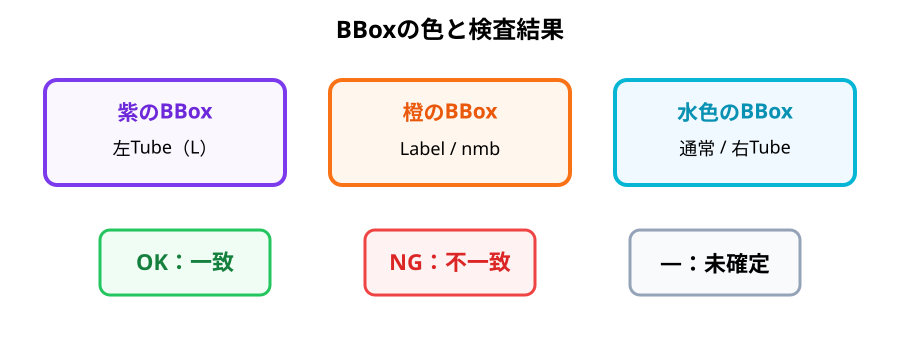
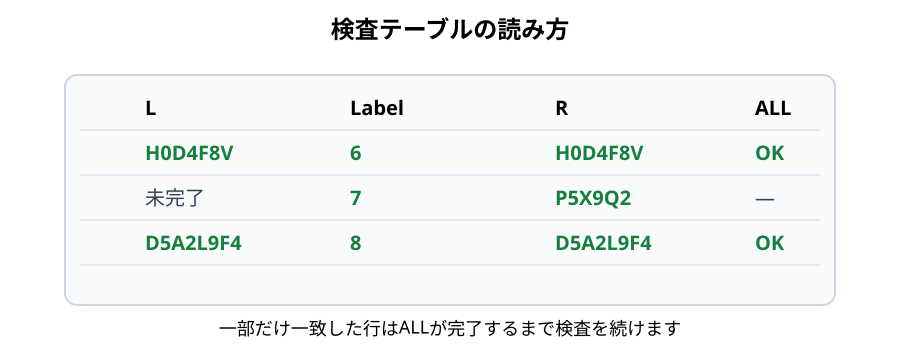
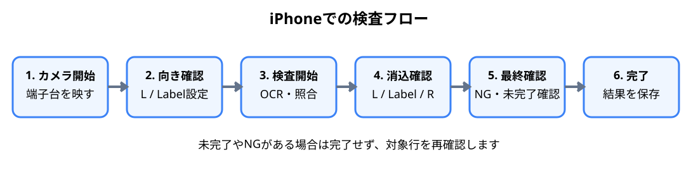

# VisionLink ユーザーガイド（Prototype / iPhone版）

VisionLinkは、端子台の左右にあるTube（線番）と中央の端子番号（Label / nmb）をカメラで読み取り、CSVの検査データと照合して配線検査を支援するWebアプリです。

> 対象版: 2026-08-24 時点のPrototype  
> 本ガイドは検査担当者向けです。画像は操作理解の補助とし、判断基準と操作方法は本文にも記載します。

## 目次

1. [検査対象と位置関係](#1-検査対象と位置関係)
2. [端子台の向き](#2-端子台の向き)
3. [検査画面](#3-検査画面)
4. [検査前チェック](#4-検査前チェック)
5. [基本操作](#5-基本操作)
6. [Lボタン（180°補正）](#6-lボタン180補正)
7. [Labelボタン（90°補正）](#7-labelボタン90補正)
8. [BBox・色・方向表示](#8-bbox色方向表示)
9. [端子番号を基準にした検査範囲](#9-端子番号を基準にした検査範囲)
10. [検査テーブル](#10-検査テーブル)
11. [OK・NG・未完了](#11-okng未完了)
12. [実際の検査フロー](#12-実際の検査フロー)
13. [うまく読めない場合](#13-うまく読めない場合)
14. [検査終了](#14-検査終了)
15. [FAQ](#15-faq)
16. [用語](#16-用語)

---

# 1. 検査対象と位置関係

## 1.1 1端子は「Tube ― 端子 ― Tube」



1端子の検査対象は横方向に並ぶ3要素です。

- **L**: 端子左側のTube。線番をOCRします。
- **Label / nmb**: 中央の端子番号。数字をOCRします。
- **R**: 端子右側のTube。線番をOCRします。

端子台全体は縦方向に並んでいますが、1端子の組合せは上下ではなく、**同じ高さにある L ― Label ― R** です。

VisionLinkは画面内の同じ文字を単純検索するのではなく、Labelを基準に左右のTubeを対応付けます。

---

# 2. 端子台の向き

## 2.1 検査時は端子台を縦向きにする



端子台の長手方向がiPhone画面の上下方向になるように撮影します。画面上では、中央にLabel列、その左にL Tube列、右にR Tube列が並ぶ状態が基本です。

### 良い撮影状態

- Label列が中央付近に連続して見える
- 左右Tubeの文字が途中で切れていない
- 端子台が大きく斜めになっていない
- 文字にピントが合っている
- 照明反射で印字が消えていない
- BBoxが対象文字をほぼ覆っている

### 避ける状態

- Label列が画面外に切れている
- 左右どちらかのTube列がほぼ見えない
- カメラを動かし続ける
- 遠すぎて文字が小さい
- 近すぎて対象が画面外へ切れる

---

# 3. 検査画面

検査画面は次の順に確認します。

1. **カメラ映像**: 端子台とBBoxを確認
2. **L / Label**: OCR方向補正
3. **カメラ開始・停止**: ライブ映像の開始・停止
4. **検査開始・停止**: OCR・照合の開始・停止
5. **進捗**: `9 / 100` のように消込件数を表示
6. **製番・番号・端子台**: 検査対象の選択
7. **L / Label / R / ALL**: 端子ごとの結果
8. **再読込**: CSVを読み直す
9. **作業者確認 / 完了**: 最終確認と保存

**カメラ開始と検査開始は別操作です。** カメラを開始しただけでは検査は始まりません。

---

# 4. 検査前チェック

| 確認項目 | 正常な状態 |
|---|---|
| ネットワーク | VisionLinkへアクセスできる |
| 製番 | 実物と画面の製番が一致 |
| 番号 | 対象と一致 |
| 端子台 | 対象端子台名と一致 |
| CSV | 期待する検査テーブルが表示 |
| カメラ | ライブ映像が表示 |
| 端子台 | 長手方向が画面上下方向 |
| Label | 中央列として検出される |
| L / R | Labelの左右に検出される |
| L補正 | 左Tubeが逆さならON |
| Label補正 | nmbが右90°倒れならON |

対象製番や端子台が違う状態では、正しい製品でも照合が一致しません。検査開始前に必ず確認してください。

---

# 5. 基本操作

## Step 1: 検査対象を選ぶ

製番、番号、端子台を選択し、検査テーブルの期待値が実物と合っていることを確認します。

## Step 2: カメラ開始

`カメラ開始` を押し、端子台を縦向きに映します。

## Step 3: BBox確認

左Tube、中央Label、右TubeにBBoxが出ていることを確認します。枠が文字から大きく外れている場合は撮影位置を調整します。

## Step 4: OCR方向を設定

- 左Tubeが逆さ → `L` ON
- nmbが右へ90°倒れている → `Label` ON

## Step 5: 検査開始

`検査開始` を押します。検査中はカメラを短時間安定させてください。

## Step 6: 消込確認

`L / Label / R / ALL` を確認します。一部だけ緑になった場合は、その項目だけが一致した状態です。

## Step 7: 未完了箇所を読む

未完了端子がある場合は、端子台との距離と角度を保ちながら、対象をゆっくり画面中央付近へ移します。

## Step 8: 最終確認

NG、未完了、Labelの誤読、対象選択ミスがないことを確認します。

## Step 9: 完了

必要に応じて`作業者確認`をチェックし、`完了`を押します。

---

# 6. Lボタン（180°補正）



`L`は左Tube専用のOCR方向補正です。

### OFF

BBoxから切り出した左Tube画像をそのままOCRします。

### ON

左Tubeの**OCR用cropだけを180°回転**してOCRします。

| 対象 | L ON時 |
|---|---|
| カメラ映像 | 回転しない |
| BBox | 回転しない |
| BBox座標 | 変わらない |
| OCR用crop | 180°回転 |

左Tubeの文字が画面上で逆さの場合だけONにします。正立している場合にONにするとOCR精度を下げる可能性があります。

## 6.1 L / Label補正を使用した実機画面


上の画面は、実際のiPhone検査画面で **L と Label の両方のOCR方向補正を有効にして検査している状態**です。

- 紫色の **L** ボタンがONです。左TubeはBBoxから切り出したOCR用cropを**180°反転**して読み取ります。
- オレンジ色の **Label** ボタンがONです。中央の端子番号（nmb）は、画面上で右へ90°倒れている数字を正立させるため、OCR用cropを**左へ90°回転**して読み取ります。
- 左TubeのBBoxは紫、中央LabelのBBoxはオレンジ、右TubeのBBoxは水色で確認できます。
- **画面上のBBox自体は回転していません。** 回転するのはBBox内部から切り出したOCR用画像だけです。
- 画像下部の検査テーブルでは、補正後のOCR結果を使って `L / Label / R / ALL` が消し込まれています。

この実機画面のように、端子台そのものは縦方向に撮影しながら、左右Tubeと中央Labelに必要なOCR補正だけを個別に適用します。

---

# 7. Labelボタン（90°補正）

`Label`は中央の端子番号（nmb）専用のOCR方向補正です。

端子台を縦向きにした際、数字が画面上で**右へ90°倒れている**場合にONにします。

処理は次の順です。

1. YOLOがnmbを検出
2. 元画像上のBBox領域をcrop
3. cropだけを**左へ90°回転**
4. 数字を正立させる
5. OCR
6. OCR結果を検査へ使用

**オレンジのBBoxそのものを回転する処理ではありません。**

実機例は [6.1 L / Label補正を使用した実機画面](#61-l--label補正を使用した実機画面) を参照してください。オレンジ色のLabelボタンと中央のオレンジBBoxが、90°補正を有効にした状態です。

---

# 8. BBox・色・方向表示



BBoxはYOLOが検出した対象範囲です。BBoxが表示されたことと、OCRが正しく読めたことは別です。

| 表示 | 主な意味 |
|---|---|
| 紫BBox | 左Tube（L）・180°補正対象 |
| オレンジBBox | Label / nmb・90°補正対象 |
| 水色BBox | 通常読取・右Tube等 |

回転補正時の方向矢印は、**OCR用cropをどちらへ補正しているか**を示します。BBoxの向きや座標が変わったことを示すものではありません。

---

# 9. 端子番号を基準にした検査範囲

VisionLinkは中央のLabelをアンカーにして左右Tubeを対応付けます。

```text
左Tube        Label        右Tube
H0D4F8V         6          H0D4F8V
P5X9Q2          7          P5X9Q2
D5A2L9F4        8          D5A2L9F4
V2C8M           9          V2C8M
```

隣接するLabel中心位置の中間を、その端子の縦方向の境界として扱います。

```text
──── Label 5 / 6 の中間 ────
  左Tube   [ Label 6 ]   右Tube
──── Label 6 / 7 の中間 ────
  左Tube   [ Label 7 ]   右Tube
──── Label 7 / 8 の中間 ────
```

同じ端子帯の中で、Labelより左をL候補、右をR候補として照合します。このため、画面の別位置に同じ線番が存在するだけでは、その端子の一致とは扱いません。

---

# 10. 検査テーブル



| 列 | 内容 |
|---|---|
| `L` | 左Tubeの線番と照合状態 |
| `Label` | 中央の端子番号と照合状態 |
| `R` | 右Tubeの線番と照合状態 |
| `ALL` | その端子全体の完了状態 |

一致した項目は緑表示になります。LabelとRだけ一致しLが未完了なら、その行全体はまだ完了ではありません。

中央Labelは表示用の飾りではありません。左右Tubeの対応付けの基準なので、誤った端子番号が表示されていないか確認してください。

---

# 11. OK・NG・未完了

## OK

CSV期待値とOCR結果が一致し、必要なL / Label / Rの対応関係が成立した状態です。

## NG

期待値とOCR結果が一致しない状態です。NGが出た場合は、実物不良と断定する前に次を確認します。

1. OCR誤読
2. BBox位置
3. L / Label回転設定
4. 製番・端子台選択
5. CSV期待値
6. 実物印字

## 未完了

まだ正しくOCR・照合できていない状態です。**未完了とNGは別です。**

---

# 12. 実際の検査フロー



### 1. カメラ開始

端子台、Label列、左右Tube列、BBoxを確認します。

### 2. 向き確認

LとLabelの補正状態を実物の文字方向に合わせます。

### 3. 検査開始

OCR・照合を開始し、短時間カメラを安定させます。

### 4. 消込確認

緑表示と進捗が増えることを確認します。未完了箇所へゆっくり移動します。

### 5. NG時

Label → L → R → 回転設定 → CSV → 実物の順で切り分けます。

### 6. 完了

未完了・NGが残っていないことを確認して完了します。

---

# 13. うまく読めない場合

## Labelが読めない

- nmbが右90°倒れならLabel ON
- Label列を画面中央へ寄せる
- 数字全体をBBox内へ入れる
- 反射とピントを確認する
- 数秒静止する

## 左Tubeが読めない

- 逆さならL ON
- 正立ならL OFF
- 線番全体がBBox内にあるか確認する

## 右Tubeが読めない

右Tubeは通常回転対象外です。撮影角度、距離、ピント、反射を確認します。

## BBoxは出るがOCRされない

BBox検出とOCRは別処理です。文字サイズ、ブレ、BBox内への収まり、OCR方向を確認します。

## 隣の端子を拾うように見える

Label検出を最優先で確認します。Label位置が不安定だと端子帯と左右Tubeの対応付けも不安定になります。

---

# 14. 検査終了

`完了`を押す前に確認します。

- 製番・端子台が正しい
- 未完了行がない
- NGが残っていない
- Label番号に不自然な誤読がない
- L / Rが期待値と一致している
- 必要に応じて作業者確認を実施した

進捗が100%でも、現場で必要な最終確認は省略しないでください。

---

# 15. FAQ

### Q. Label ONでBBoxも90°回転しますか？

いいえ。回転するのはOCR用cropだけです。

### Q. L ONでカメラ映像が180°回転しますか？

いいえ。左TubeのOCR用cropだけを180°回転します。

### Q. 紫・オレンジ・水色は合否ですか？

いいえ。主に対象種類とOCR方向を示すBBox色です。合否は検査テーブルで確認します。

### Q. Labelだけ読めれば完了ですか？

いいえ。必要な左右Tubeの照合も必要です。

### Q. NGが出たら即不良ですか？

OCR誤読の可能性があるため、BBox、回転設定、CSV、実物を確認してください。

---

# 16. 用語

| 用語 | 意味 |
|---|---|
| Tube | 端子に接続された電線のチューブ。線番が印字される |
| L | 左Tube |
| R | 右Tube |
| Label / nmb | 中央の端子番号 |
| BBox | YOLOが検出した対象領域を示す枠 |
| OCR | 画像から文字を読み取る処理 |
| crop | BBox内部から切り出したOCR用画像 |
| CSV | システムに登録された検査期待データ |
| 消込 | 一致した項目を検査済みとして反映すること |
| ALL | 1端子として必要な検査が揃った状態 |

---

## 関連ドキュメント

- [README.md](README.md) - Docs一覧
- [SPEC.md](SPEC.md) - システム仕様
- [ARCHITECTURE.md](ARCHITECTURE.md) - システム構成
- [OCR_STRATEGY.md](OCR_STRATEGY.md) - OCR・回転補正・照合方針
- [API.md](API.md) - Backend API
- [TODO.md](TODO.md) - 今後の課題